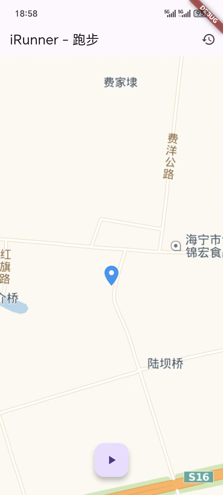
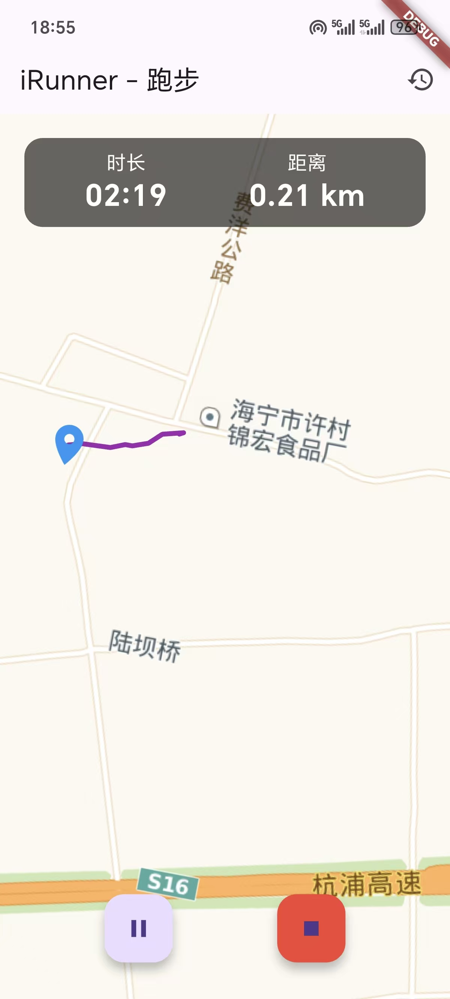
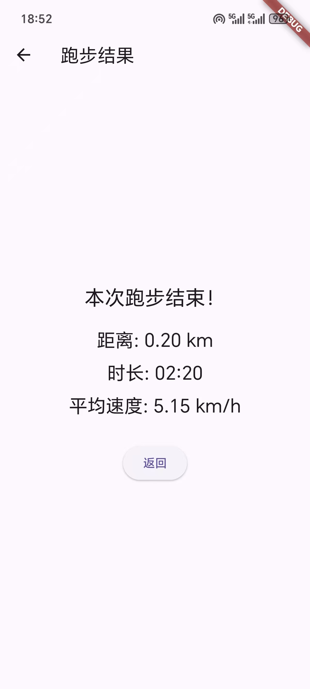

# iRunner 跑步应用

## 1. 项目简介

`iRunner` 是一款旨在帮助用户记录跑步过程、追踪运动数据并提供成就激励的移动应用。项目基于 `Flutter` 框架开发，可以轻松实现跨平台部署。

本项目致力于提供一个清晰、稳定且易于扩展的代码基础，方便后续进行协作开发和功能迭代。

## 2. 应用截图

| 主界面 | 跑步过程 | 结果页 |
| :---: | :---: | :---: |
|  |  |  |
| **成就解锁** | **历史列表** | **跑步详情** |
|  |  |  |

## 3. 主要功能

以下是项目当前已实现的功能。

-  **核心跑步功能**
    -  **实时定位**: 在地图上展示用户当前位置。
    -  **过程控制**: 实现跑步的 `开始` / `暂停` / `继续` / `结束` 逻辑。
    -  **实时轨迹绘制**: 在地图上实时描绘用户的运动路径。
    -  **实时数据展示**: 跑步过程中实时显示运动时长、距离等。
-  **数据统计与历史**
    -  **单次总结**: 跑步结束后，展示总距离、总时长、平均配速等关键数据。
    -  **历史记录**: 保存每一次的跑步数据，并提供列表页面供用户回顾。
    -  **详情回顾**: 用户可以查看任意一次跑步的详细数据，包括运动轨迹地图。
-  **成就系统**
    -  **成就解锁**: 根据跑步数据（例如：首次完成跑步、达到特定距离等）解锁相应成就。


## 4. 技术栈

| 类别 | 技术/库 | 用途 |
| :--- | :--- | :--- |
| **核心框架** | Flutter (Dart) | 跨平台应用开发 |
| **地图与定位** | [flutter_map](https://pub.dev/packages/flutter_map) | 在应用内集成 OpenStreetMap 地图 |
| | [geolocator](https://pub.dev/packages/geolocator) | 获取设备GPS定位 |
| **本地存储** | [shared_preferences](https://pub.dev/packages/shared_preferences) | 轻量级数据持久化，用于保存跑步历史和成就 |
| **工具库** | [intl](https://pub.dev/packages/intl) | 提供国际化和日期/数字格式化功能 |


## 5. 项目结构

项目代码主要存放于 `lib` 目录下，遵循以下结构组织：

```
lib/
├── main.dart               # 应用主入口及主页面
├── models/                 # 数据模型 (run_session.dart)
├── screens/                # 各个独立的页面 (history_page.dart, run_detail_page.dart)
├── services/               # 后端服务封装 (history_service.dart)
├── widgets/                # 可复用的UI组件 (history_list_item.dart)
├── achievement_system.dart # 成就系统逻辑
├── result_page.dart        # 结果页面
└── utils.dart              # 工具类
```

## 6. 快速开始

请遵循以下步骤在本地环境中设置和运行项目。

### 6.1. 环境准备

- **Flutter SDK**: 版本 `3.x` 或更高。请参考 [Flutter官方文档](https://flutter.cn/docs/get-started/install) 进行安装。
- **开发工具**: Android Studio 或 Visual Studio Code (需安装 Flutter 和 Dart 插件)。
- **安卓设备或模拟器**

### 6.2. 项目配置

1.  **克隆项目**
    ```bash
    git clone https://github.com/OrangeQu/iRunner-iOS.git
    cd irunner_ios
    ```

2.  **安装依赖**
    ```bash
    flutter pub get
    ```

3.  **配置高德地图 API Key**

    > **[!] 重要提示**: 地图功能需要使用高德地图API Key。请前往 [高德地图开放平台](https://lbs.amap.com/) 注册并申请一个Key（选择 **Android平台**）。

    获取Key后，在 `android/app/src/main/AndroidManifest.xml` 文件中找到如下代码块，并替换 `android:value` 的值为你的Key：

    ```xml
    <!-- android/app/src/main/AndroidManifest.xml -->
    <application ...>
        ...
        <meta-data
            android:name="com.amap.api.v2.apikey"
            android:value="在这里替换成你的高德地图API KEY"/>
        ...
    </application>
    ```

### 6.3. 运行项目

确保你的安卓设备已连接或模拟器已启动，然后在项目根目录执行：

```bash
flutter run
```

## 7. 构建与部署

### 构建 Android APK

如需生成可供安装的APK文件，请运行：

```bash
flutter build apk --release
```

构建成功后，APK文件会生成在 `build/app/outputs/flutter-apk/app-release.apk`。

## 8. 功能展望

在当前版本的基础上，项目仍有许多可扩展的方向：

- AI计划：分析你的身体条件，连接大模型分析，帮助你设计适合你的跑步计划（公里数，配速，消耗卡路里等等）。
- 数据可视化：引入图表库，对历史数据进行可视化分析。
- 数据保存：支持用户注册登录，实现数据云端同步。
- 语音播报：每跑完1公里，播报该公里的配速和消耗的卡路里，在完成相应的目标后进行语音播报。

---

通过本次课程设计，我完整地体验了App从概念到实现的全过程。虽然项目功能仍相对基础，但这次实践是学习应用开发的一次宝贵经历。
